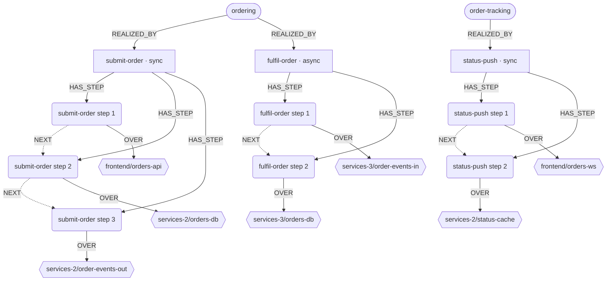
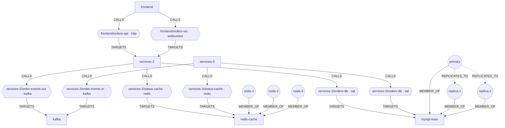

# shop — reference manifest

The worked example for [ADR 0015](../../adr/0015-system-manifest-as-a-traversable-graph.md).
[`manifest.yaml`](manifest.yaml) is what a user writes; this page is what Heimdall compiles
it into, what the model is shown, and how an investigation walks it.

## The system

A frontend talks to `services-2` over REST and WebSockets. Placing an order writes to MySQL
and publishes to Kafka; `services-3` consumes the event and completes the order. Both
services share a three-node Redis cluster and a MySQL primary with two asynchronous
replicas; writes go to the primary, reads to the replicas.

| Kind | Resources |
|---|---|
| `System` | `shop`, environment `prod` |
| `Component` | `frontend`, `services-2`, `services-3`, `kafka`, `redis-cache`, `mysql-main` |
| `Functionality` | `ordering`, `order-tracking` |
| `Flow` | `submit-order`, `fulfil-order`, `status-push` |

## The graph

58 vertices and 71 edges: 32 structural vertices, plus 26 indicators, each attached by one
`MEASURES` edge. It is drawn in two halves that meet at the dependency vertices.

### Business side: functionalities, flows, steps



### Infrastructure side: components, dependencies, members



Edge direction always means "depends on". `services-3 → order-events-in → kafka` points at
Kafka although messages travel the other way; the direction data travels is a property of
the dependency.

### Vertices

| Type | Count | Compiled from |
|---|---|---|
| functionality | 2 | `kind: Functionality` |
| flow | 3 | `kind: Flow` |
| step | 7 | `Flow.spec.steps[]`, identified as `flow#position` |
| dependency | 8 | `Component.spec.dependsOn[]`, identified as `component/name` |
| component | 6 | `kind: Component` |
| member | 6 | `Component.spec.topology.members[]` |
| indicator | 26 | declared `indicators`, plus derived ones (below) |

Dependencies are vertices, not edges, because steps and indicators reference one specific
dependency, and an edge cannot be the target of another edge. `frontend/orders-api` and
`frontend/orders-ws` join the same two components and must stay distinct.

### Edges

| Type | Count | From → to | Compiled from |
|---|---|---|---|
| `REALIZED_BY` | 3 | functionality → flow | `Functionality.spec.flows` |
| `HAS_STEP` | 7 | flow → step | `Flow.spec.steps[]` |
| `NEXT` | 4 | step → step | order of `steps[]` |
| `OVER` | 7 | step → dependency | `steps[].dependency` |
| `CALLS` | 8 | component → dependency | `dependsOn[]` on the caller |
| `TARGETS` | 8 | dependency → component | `dependsOn[].target` |
| `MEMBER_OF` | 6 | member → component | `topology.members[]` |
| `REPLICATES_TO` | 2 | primary → replica | `topology.mode: primary-replica` and member roles |
| `MEASURES` | 26 | indicator → subject | declared and derived indicators |

### Dependencies

| | Reference | Transport | Mode | Criticality | Operations | Step |
|---|---|---|---|---|---|---|
| e1 | `frontend/orders-api` → services-2 | http | sync | hard | `POST /orders` | submit-order#1 |
| e2 | `frontend/orders-ws` → services-2 | websocket | sync | hard | subscribe | status-push#1 |
| e3 | `services-2/order-events-out` → kafka | kafka | async | hard | produce `order-events` | submit-order#3 |
| e4 | `services-3/order-events-in` → kafka | kafka | async | hard | consume `order-events`, group `s3-orders` | fulfil-order#1 |
| e5 | `services-2/status-cache` → redis-cache | redis | sync | soft | HGET, HSET | status-push#2 |
| e6 | `services-3/status-cache` → redis-cache | redis | sync | soft | HGETALL, SMEMBERS | — |
| e7 | `services-2/orders-db` → mysql-main | sql | sync | hard | INSERT, SELECT; writes primary, reads replicas | submit-order#2 |
| e8 | `services-3/orders-db` → mysql-main | sql | sync | hard | UPDATE, SELECT; writes primary, reads replicas | fulfil-order#2 |

`e1`–`e8` are labels for this page only; the identity in the graph is the reference.

## Indicators

12 declared by the user and 14 derived by Heimdall.

**Derivation rules:**

- **Step.** A metric definition applies to a step when it measures the step's dependency —
  `measures.outbound` naming it on the caller, or `measures.inbound` for its transport on
  the target — and its label semantics cover every key of the step's `match`. The step's
  `match` becomes the selector.
- **Component.** Every inbound metric definition, and every definition with a `role` and no
  `measures`, gives a component indicator.
- **Roles.** An explicit `role` wins. Otherwise a histogram gives throughput and latency, a
  counter gives throughput, and either also gives errors when a label means `statusCode` or
  `outcome`. A gauge without a `role` gives nothing.
- A declared indicator for the same subject and metric suppresses the derived one.
  Derived indicators default to a `baseline` expectation.

| Subject | Metric | Role | Expectation | Provenance |
|---|---|---|---|---|
| ordering | `services-2/orders_created_total` | kpi | baseline | declared |
| ordering | `orders_fulfilled_total / orders_created_total` | kpi | slo ≥ 0.99 | declared |
| order-tracking | `services-2/ws_active_connections` | kpi | baseline | declared |
| order-tracking | `services-2/status_push_delivered_total` | kpi | nonZero | declared |
| submit-order | `services-2/order_submit_seconds` | latency | slo p95 ≤ 0.8s | declared |
| fulfil-order | `services-3/order_fulfilment_seconds` | latency | slo p95 ≤ 30s | declared |
| status-push | `services-2/status_push_delay_seconds` | latency | baseline | declared |
| submit-order#1 | `services-2/http_server_requests_seconds` | throughput, errors, latency | baseline | derived |
| submit-order#2 | `services-2/db_client_seconds` | throughput, errors, latency | baseline | derived |
| submit-order#3 | `services-2/kafka_producer_errors_total` | errors | baseline | derived |
| fulfil-order#1 | `kafka/kafka_consumergroup_lag` | lag | threshold ≤ 1000 | declared |
| fulfil-order#1 | `services-3/kafka_consumer_records_total` | throughput | baseline | derived |
| fulfil-order#2 | `services-3/db_client_seconds` | throughput, errors, latency | baseline | derived |
| status-push#1 | `services-2/ws_messages_failed_total` | errors | baseline | derived |
| status-push#2 | `services-2/redis_client_seconds` | throughput, errors, latency | baseline | derived |
| frontend | `browser_errors_total` | errors | baseline | declared |
| services-2 | `http_server_requests_seconds` | throughput, errors, latency | baseline | derived |
| services-2 | `ws_messages_failed_total` | errors | baseline | derived |
| services-2 | `nodejs_eventloop_lag_seconds` | saturation | baseline | derived |
| services-3 | `nodejs_eventloop_lag_seconds` | saturation | baseline | derived |
| kafka | `kafka_under_replicated_partitions` | saturation | baseline | derived |
| redis-cache | `redis_memory_used_bytes / redis_memory_max_bytes` | saturation | threshold ≤ 0.8 | declared |
| redis-cache | `redis_evicted_keys_total` | errors | baseline | derived |
| mysql-main | `mysql_global_status_threads_connected` | saturation | baseline | derived |
| mysql-main/replica-1 | `mysql_replica_lag_seconds` | lag | threshold ≤ 5s | declared |
| mysql-main/replica-2 | `mysql_replica_lag_seconds` | lag | threshold ≤ 5s | declared |

## What the model is shown

Level 0 of the model view, always in the prompt. About 1k characters, against about 10k for
`manifest.yaml`:

```text
system shop · env prod
ordering: customers place orders, fulfilled async | kpi orders_created ~baseline, fulfilled/created ≥0.99
  submit-order sync: frontend/orders-api POST /orders ▸ services-2/orders-db INSERT orders ▸ services-2/order-events-out produce order-events
  fulfil-order async, no trace context, join on orderId: services-3/order-events-in consume order-events ▸ services-3/orders-db UPDATE orders
order-tracking: customers see live order status | kpi ws_active_connections ~baseline, status_push_delivered >0
  status-push sync: frontend/orders-ws /ws/orders ▸ services-2/status-cache HGET
frontend frontend → services-2 http hard, websocket hard
services-2 service → kafka async · redis-cache soft · mysql-main hard w:primary r:replicas
services-3 service → kafka async consume s3-orders · redis-cache soft · mysql-main hard w:primary r:replicas
kafka broker [order-events] · redis-cache cache [node-1..3] · mysql-main datastore [primary → replica-1, replica-2 async]
not on any flow: services-3/status-cache
```

Matchers, label semantics, instance addresses and units never reach the model. They are
what `check(indicator, window)` uses to build the query.

## Walks

### Upward: a replica lags

An alert fires on `mysql_replica_lag_seconds{instance="mysql-1:9104"}`.

1. `locate` matches the instance label to member `mysql-main/replica-1` exactly; no model
   involved.
2. `impact(replica-1)`: `MEMBER_OF` → `mysql-main` ← `TARGETS` ← `services-2/orders-db` and
   `services-3/orders-db`, both reading from replicas.
3. `OVER` ← `submit-order#2` and `fulfil-order#2`; `HAS_STEP` ← `submit-order`,
   `fulfil-order`; `REALIZED_BY` ← `ordering`.
4. The model receives this slice and its indicators. `fulfil-order` is async and reads
   through a replica an order that `submit-order` wrote to the primary, so the hypothesis
   to check is stale reads: `check` on `fulfil-order#2` errors and on the `ordering`
   fulfilled/created ratio.

### Downward: a KPI drops

The `ordering` fulfilled/created ratio falls below 0.99.

1. `path(ordering)` returns `submit-order` and `fulfil-order` with their ordered steps.
2. `submit-order` indicators are healthy. In `fulfil-order`, `check` runs step by step:
   `fulfil-order#1` consumer lag is above 1000, the first failing step.
3. The step's dependency is `services-3/order-events-in`, so `subgraph` narrows to
   `services-3` and `kafka`. `services-3` event-loop lag is high; Kafka is healthy.
4. `fulfil-order` does not propagate trace context, so the model joins `services-3` logs to
   the stalled orders on `orderId` rather than by trace.

## Coverage findings

What a manifest lint would report for this system:

- `services-3/status-cache` is on no flow, so a Redis problem there has no declared
  business impact.
- `frontend` has a logs identity only: no metrics matchers and no traces.
- `fulfil-order` crosses Kafka without trace context and relies on `correlationKey`.
